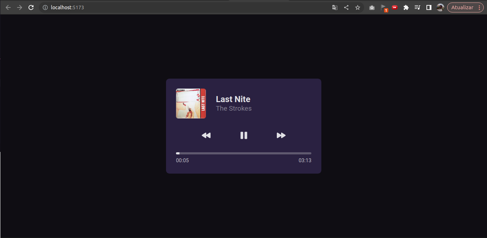
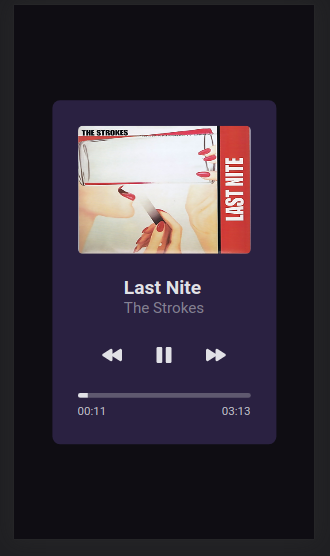

# Bora codar 01 - Player de música

## :information_source: Apresentação

Projeto criado com o desafio de criar um Player de música funcional e responsivo

<a href="https://www.figma.com/file/R9TPGnj4L2md3LvhGRuP39/%23boraCodar---Desafio-1-(Copy)?node-id=1%3A61&t=U2qtX7rOxzKFNZd9-0" target="_blank">
  
</a>

## :fireworks: Imagens

### Desktop
<div justify="center">
  
</div>

### Mobile
<div justify="center">
  
</div>

## :rocket: Iniciando projeto

- Instale as dependências:

```bash
npm i
```


- Rode o projeto:

```bash
npm run dev
```
